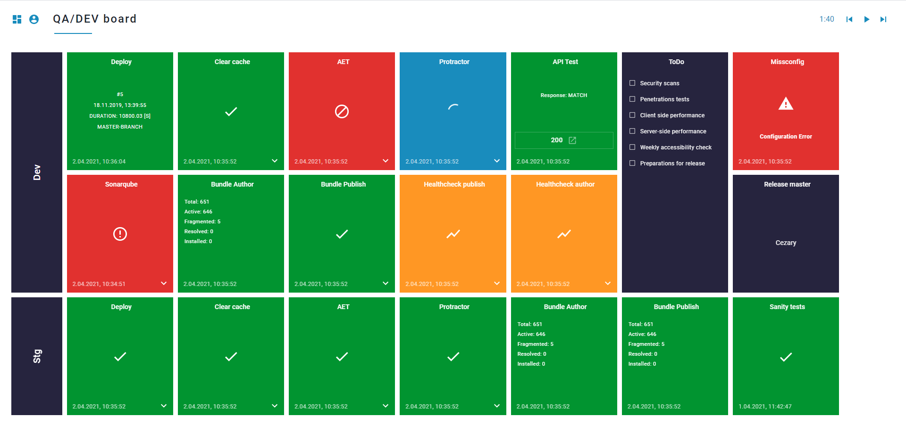
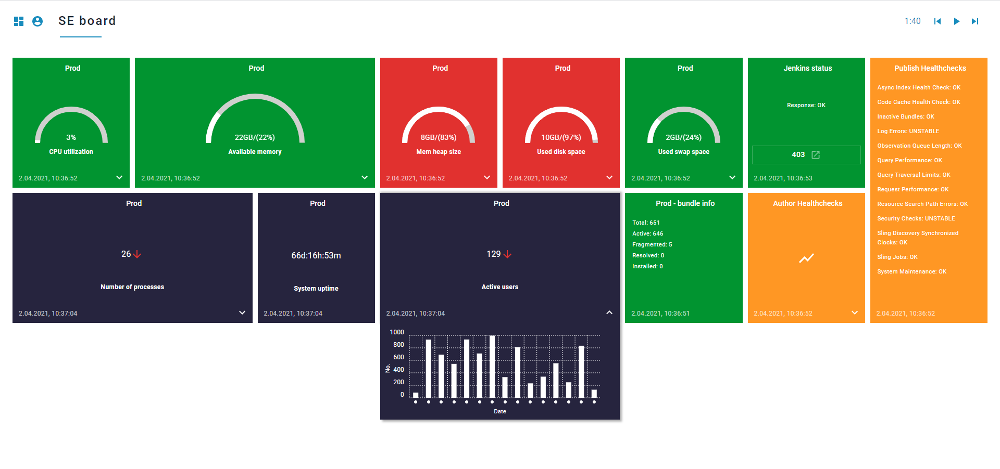
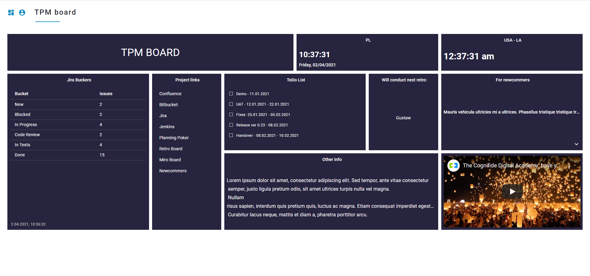

# Cogboard

  

## What's Cogboard

CogBoard is a tool that provides your team with a continous information about your project delivery status and as a result of this allows for a continous reaction to any inadequacies.

## Getting started

CogBoard is designed to be easy to setup. Please follow the [Getting started](https://github.com/wttech/cogboard/wiki#getting-started) steps in order to begin your adventure with the tool.

## What makes it special?

How it’s built. We’ve been using new technologies when working on CogBoard. Please see our [Tech Stack](https://github.com/wttech/cogboard/wiki#stack) in order to learn more.

How it works. CogBoard allows for gathering data from a wide range of external data sources such as AEM, Bamboo, Jenkins, SonarQube etc, and gives a possibility of monitoring the data on your personalised dashboards, while using available [widgets](https://github.com/wttech/cogboard/wiki#widgets), or by creating [new widgets](https://github.com/wttech/cogboard/wiki#widget-development).

## Example dashboards

## What benefits it brings?

With CogBoard, you can increase your team members’ visibility on all the environments they are responsible for. What’s more, you can gain agility. Instead of pulling your project delivery status report once a week or so, you gain access to the information on a rolling basis. As a result of this, you save your time and have the opportunity to react quicker. The tool allows also its users for a better collaboration. Everyone from your team gets access to exactly the same information. Thanks to this, anyone from your team can be a life-saver, and take action when needed.

## Contributing

We would love you to join our community and contribute into this project via [GitHub](https://github.com/wttech/cogboard). Please read our [Collaboration info](https://github.com/wttech/cogboard/blob/master/CONTRIBUTING.md) and [Code of Conduct](https://github.com/wttech/cogboard/blob/master/CODE_OF_CONDUCT.md) in order to learn more.

## Documentation

Please see the link in order to get access to our complete [Documentation](https://github.com/wttech/cogboard/wiki).

## License

Cogboard is licensed under [Apache License, Version 2.0](https://www.apache.org/licenses/LICENSE-2.0.txt).
