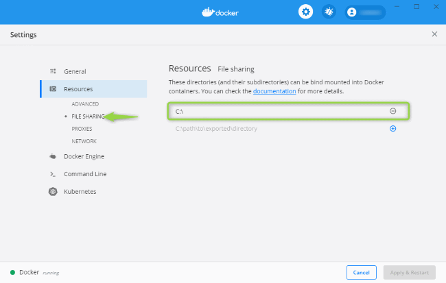

## Prerequisites - Installed Docker CE

* Install Docker CE on **Windows 10** - follow instructions [here](https://docs.docker.com/docker-for-windows/install/) and execute required config steps:
  * Make sure that `Hyper-V` is enabled  
    
  * Log-in to `Docker Desktop` in Windows tray
  * Check `Expose daemon on...` property  
    
  * Share drive where cogboard was cloned  
    

* Install Docker CE on **Mac OS** - follow instructions [here](https://docs.docker.com/docker-for-mac/install/)
* Install Docker CE on **Ubuntu Linux** - `sudo apt-get install docker-ce`, more instructions [here](https://www.digitalocean.com/community/tutorials/how-to-install-and-use-docker-on-ubuntu-16-04)

## Endpoints setup
In order to use widgets that communicate with third party software you must first configure endpoints.  
Edit this file `knotx/conf/endpoints.conf`.  
Any sensitive data from `endpoints.conf` file is never accessible for end-users. Only `id` and `title` can be requested.

## How to run

#### Initialization step 
 
Execute below command once for initial configuration. This step will create required config files.
```cmd
./gradlew cogboardInitConfigs
```

#### Run
Use below command to assemble and deploy Cogboard docker app.
```cmd
./gradlew
```

##### When launched go to http://localhost:8092/index.html to see your board

## Go to [Wiki](https://github.com/Cognifide/cogboard/wiki) section for more details

## Stack
 * Platform: [Docker](https://www.docker.com/) and [Knot.x](http://knotx.io/)
 * Backend language: [Kotlin](https://kotlinlang.org/)
 * Layout: [CSS Grid](https://developer.mozilla.org/en-US/docs/Web/CSS/CSS_Grid_Layout)
 * Webapp: [React JS](https://reactjs.org/)
 * Webapp UI: [Material UI](https://material-ui.com/)
 * Webapp model: [Redux](https://redux.js.org/)
 * Build with: [Gradle](https://gradle.org/)
