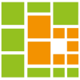
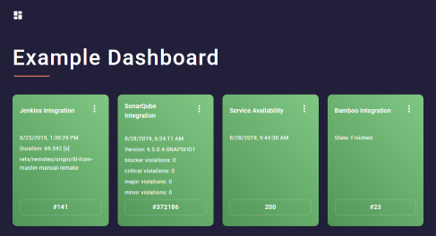
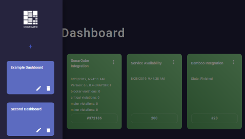

## **Cogboard** helps you create dashboards for your project needs.
  
---
Information is a key to success, with **Cogboard** you can gather all the information about project in one place.

#### We designed Cogboard with these principles in mind:
**Easy to use** - comes with a set of ready to use Widgets that can be configured in Web browser.  
**Easy to deploy** - works on any machine with `Docker CE` and `JVM`.  
**Easy to extend** - creating new Widget is [simple](https://github.com/Cognifide/cogboard/wiki/Widget-development).  
**Secure** - all integrations are done on backend.  

Find out more on [GitHub](https://github.com/Cognifide/cogboard) and [Wiki](https://github.com/Cognifide/cogboard/wiki) pages.

---
Some screenshots:
  
  
  
  
