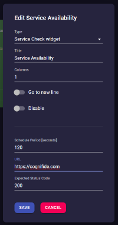

## **Cogboard** helps you create dashboards for your project needs.

**Easy to use** - comes with a set of ready to use Widgets, configuration in a web browser.  
**Easy to deploy** - works on any machine with `Docker CE` and `JVM`.  
**Easy to extend** - creating new Widget is [simple](https://github.com/Cognifide/cogboard/wiki/Widget-development).  
**Secure** - all integrations are done on backend.  

Find out more on [GitHub](https://github.com/Cognifide/cogboard) and [Wiki](https://github.com/Cognifide/cogboard/wiki) pages.

  
  
  
  
