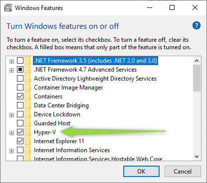
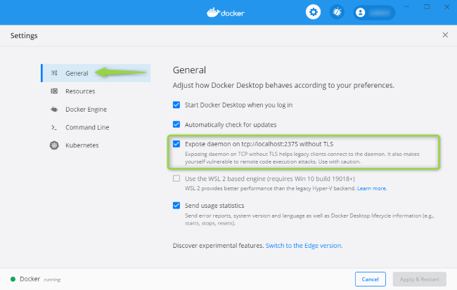
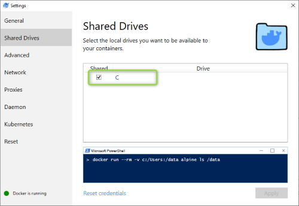

# [Home](/cogboard/) >> Setup

## Prerequisites - Installed Docker CE

- Install Docker CE on **Windows 10** - follow instructions [here](https://docs.docker.com/docker-for-windows/install/) and execute required config steps:

  - Make sure that `Hyper-V` is enabled  
    
  - Log-in to `Docker Desktop` in Windows tray
  - Check `Expose daemon on...` property  
    
  - Share drive where cogboard was cloned  
    

- Install Docker CE on **Mac OS** - follow instructions [here](https://docs.docker.com/docker-for-mac/install/)
- Install Docker CE on **Ubuntu Linux** - `sudo apt-get install docker-ce`, more instructions [here](https://www.digitalocean.com/community/tutorials/how-to-install-and-use-docker-on-ubuntu-16-04)

## Endpoints setup

##### This configuration will soon be managed fom UI directly

In order to use widgets that communicate with third party software you must first configure endpoints.  
Edit this file `mnt/endpoints.json`.  
Any sensitive data from `endpoints.json` file is never accessible for end-users. Only `id` and `title` can be requested.

## How to run Cogboard in developer mode

To build and run use default task:

```cmd
./gradlew
```

To un-deploy docker stack

```cmd
./gradlew undeployLocal
```

## How to run Cogboard in production ready mode

`TODO`: Design how to setup for production

##### When launched go to [http://localhost:8092](http://localhost:8092) to see your board

##### When launched with mocks app is available as above. For mocks open [http://localhost:8093/\_\_admin](http://localhost:8080/__admin) to see mocks configuration

##### Login to manage boards >> default credentials: `admin` : `admin`
